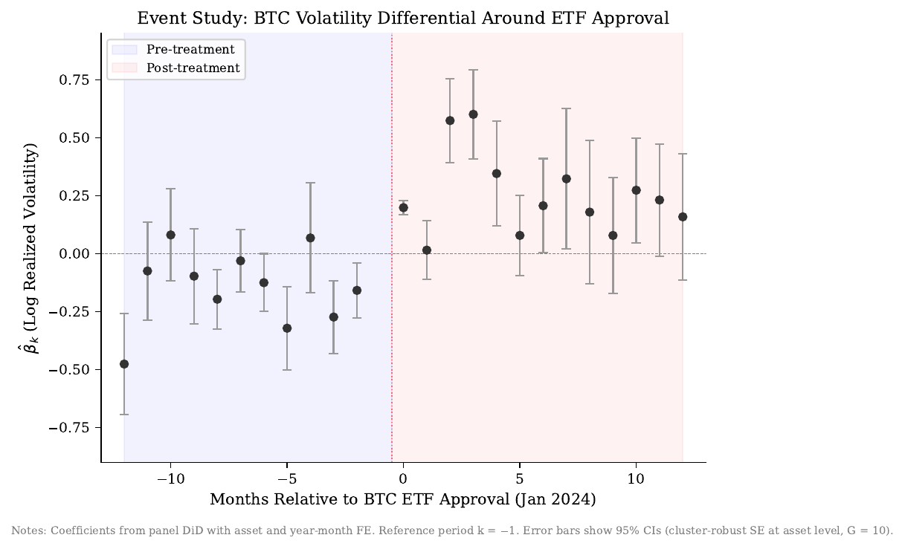

# E2ER v3: End-to-End Researcher

[]()
[](LICENSE)
[]()
[](https://github.com/bhanneke/E2ER-project/actions/workflows/tests.yml)

**E2ER** is an open-source pipeline for producing peer-review-quality empirical research papers in information systems, economics, and finance. The researcher provides a research question and data access; the pipeline handles the rest: study design, data acquisition, econometric estimation, writing, review, and replication packaging.

> **Scope**: E2ER is optimised for empirical papers. It works best with structured data, a clear identification strategy, and established econometric methods. It is not designed for purely theoretical work.

---

## What the system produces

For each paper, E2ER produces:

| Artifact | Description |
|----------|-------------|
| `paper_plan.md` | Research design, propositions, identification strategy |
| `literature_review.md` | Related work synthesis with citations |
| `identification_strategy.md` | Causal identification argument and threats |
| `econometric_spec.md` | Econometric specification with equations |
| `data_dictionary.json` | Pre-specified minimal data footprint (fields, time filter, granularity) |
| `paper_draft.tex` | Full LaTeX manuscript |
| `abstract.tex` | Standalone abstract |
| `self_attack_report.json` | Adversarial flaw-finding report with severity scores |
| `review_*.md` | Structured reviews from 6 specialist reviewers |
| `review_aggregation.json` | Mechanical aggregation verdict and scores |
| `replication/estimation.py` | Main econometric estimation code |
| `replication/data_queries.sql` | All data queries used in the paper |
| `replication/audit_log.csv` | Complete data access audit trail |

All artifacts are committed to a dedicated GitHub repository for the paper, structured for direct import into Overleaf.

---

## Pipeline stages

```
[Researcher input: RQ + optional BibTeX + optional data]
          |
          v
    1. Study Design      idea_developer, literature_scanner, identification_strategist
    2. Data              data_architect -> Allium queries -> human approval -> data_analyst
    3. Estimation        econometrics_specialist
    4. Writing           section_writer, abstract_writer, latex_formatter
          |
          v  (iterative mode only)
    5. Ceiling Check     Strategist assesses whether further iteration adds value
    6. Self-Attack       Adversarial specialist finds critical flaws (severity 1-10)
    7. Polish            5 parallel specialists: formula, numerics, institutions, bibliography, equilibria
          |
          v
    8. Review            6 parallel reviewers: mechanism, technical, identification,
                         literature, data, writing
    9. Aggregation       3-rule mechanical verdict (see below)
   10. Revision          Revisor specialist addresses feedback (if MAJOR_REVISION verdict)
   11. Replication       Packages all queries, code, and audit trail
   12. GitHub Push       LaTeX + replication package committed to paper repo
```

---

## Review aggregation

Reviews are aggregated by three deterministic rules applied in order:

| Rule | Condition | Verdict |
|------|-----------|---------|
| 1 | Mechanism reviewer score < 5 | `MECHANISM_FAIL`: fundamental revision required |
| 2 | Any reviewer score < 4 | `HARD_REJECT`: floor violation |
| 3 | Weighted average (technical x 1.5, identification x 1.5, data x 1.25) | `ACCEPT` / `MINOR_REVISION` / `MAJOR_REVISION` / `HARD_REJECT` |

---

## Data access: Allium

The data module uses [Allium](https://allium.so) for indexed blockchain data. Set `ALLIUM_API_KEY` in `.env` to enable it. The pipeline also runs without data (literature-only or with manually provided files).

Every query passes through 5 guardrails before execution:

1. No `SELECT *`: all fields must be listed explicitly
2. All requested fields must be declared in the paper's `data_dictionary.json`
3. A time-bound `WHERE` clause is required on every query
4. Transaction-level granularity requires written justification
5. Production queries require a prior approved feasibility run on the same table

**Two-phase workflow:**
- **Feasibility** (1000-row sample): auto-approved, executes immediately
- **Production** (full dataset): queued for researcher approval at `GET /api/papers/{id}/pending-queries`

We gratefully acknowledge **[Allium](https://allium.so)** for supporting this research through data access and technical collaboration.

---

## Literature: bring your own BibTeX

E2ER does **not** automatically retrieve papers from the internet. The recommended approach is to supply a `.bib` file of your own curated references.

Set `LITERATURE_BIBTEX_FILE=/path/to/refs.bib` in your `.env`. When set, the pipeline:

1. Parses all entries at startup (requires `bibtexparser` — included in `pip install -e .`)
2. Injects a compact reference list into the prompts of: `literature_scanner`, `paper_drafter`, `section_writer`, `abstract_writer`, and `revisor`
3. Copies the `.bib` file into the workspace so LaTeX can compile with `\bibliography{refs}`

A typical BibTeX workflow:

```bash
# Export your references from Zotero / Mendeley as refs.bib
# Add to .env:
LITERATURE_BIBTEX_FILE=/home/researcher/my-project/refs.bib
```

The `literature_scanner` specialist will synthesise the provided references and flag gaps where additional literature search is needed. The `paper_drafter` will use `\cite{}` commands aligned with the BibTeX keys in your file.

> **Planned extension**: Open-access paper fetching via OpenAlex, Semantic Scholar, and arXiv is implemented in `src/modules/literature/` but not yet wired into the pipeline. Contributions welcome — see `skills/CONTRIBUTING_SKILLS.md` for the extension pattern.

---

## Quick start

```bash
git clone https://github.com/bhanneke/E2ER-project.git
cd E2ER-project
./scripts/quickstart.sh        # prompts for ANTHROPIC_API_KEY, builds + starts everything
```

The script copies `.env.example` to `.env`, prompts once for your Anthropic API key, runs `docker compose up --build`, and opens the dashboard at <http://localhost:8280/>. Migrations run automatically on first start. Total time-to-first-paper: typically under 5 minutes for the build step plus your run time.

### Verify your install

Before configuring an API key, confirm the pipeline runs end-to-end with mocks:

```bash
make install   # pip install -e ".[dev]"
make smoke     # full mocked test suite — no API key needed, ~15s
```

If `make smoke` reports `155 passed`, your install is good and the orchestration works.

To run a real $0.50 end-to-end test on Claude Haiku (requires `ANTHROPIC_API_KEY`):

```bash
ANTHROPIC_API_KEY=sk-ant-... make smoke-paid
```

### Dashboard

Once running, the dashboard at `http://localhost:8280/` lets you:

- **Start a paper** — title, research question, mode (single_pass / iterative), per-paper cost cap.
- **Watch progress live** — status badge, cost meter (spent / cap), event log polled every 3 seconds.
- **Cancel** — one click during any phase; the runner saves state and marks the paper `cancelled`.
- **Download artifacts** — every workspace file and a one-click **audit bundle** (`.tar.gz` containing `replication/`, `audit_log.csv`, `data_queries.sql`, `manifest.json`, `contributions.json`, `events.json`, `usage.json`).

### Cost safety

Every paper has a hard cost cap (default $25; configurable per paper at creation time, or via `DEFAULT_MAX_COST_USD` in `.env`). The pipeline checks cumulative cost at every phase boundary; when the cap is reached the run aborts with `last_error = "Budget exceeded after $X.XX"` and the paper is marked `failed`.

### Programmatic API

If you prefer the HTTP API to the dashboard:

```bash
# Create a paper
curl -X POST http://localhost:8280/api/papers \
  -H "Content-Type: application/json" \
  -d '{
    "title": "DeFi Liquidity Provision and Market Quality",
    "research_question": "How does concentrated liquidity in Uniswap v3 affect price discovery?",
    "mode": "iterative",
    "max_cost_usd": 30.0
  }'
# Returns: {"paper_id": "<uuid>", "status": "idea", ...}

# Cancel
curl -X POST http://localhost:8280/api/papers/<paper_id>/cancel

# Download audit bundle
curl -O -J http://localhost:8280/api/papers/<paper_id>/audit-bundle

# Approve pending data queries (when the data module submits production queries)
curl http://localhost:8280/api/papers/<paper_id>/pending-queries
curl -X POST http://localhost:8280/api/queries/<query_id>/approve \
  -H "Content-Type: application/json" \
  -d '{"approved": true, "note": "Looks good"}'
```

### Manual install (without Docker)

```bash
pip install -e ".[pgvector]"
docker compose -f docker/docker-compose.yml up -d db    # just the DB
python scripts/migrate.py
bash scripts/vendor_htmx.sh                              # one-time, fetches htmx
uvicorn src.api.app:app --reload --port 8280
```

---

## Supported LLM providers

| Provider | Setting | Notes |
|----------|---------|-------|
| Anthropic | `LLM_BACKEND=anthropic` | Supports prompt caching (recommended) |
| OpenRouter | `LLM_BACKEND=openrouter` | 200+ models via OpenAI-compatible format |

---

## Architecture diagrams

An [interactive system architecture diagram](docs/architecture.html) (open in browser) is available in `docs/`.

Individual Mermaid diagrams in [`docs/diagrams/`](docs/diagrams/), rendered natively on GitHub:

| Diagram | Description |
|---------|-------------|
| [`pipeline_overview.md`](docs/diagrams/pipeline_overview.md) | Full pipeline from idea to completion |
| [`specialist_dag.md`](docs/diagrams/specialist_dag.md) | Specialist execution dependencies and parallel groups |
| [`data_module.md`](docs/diagrams/data_module.md) | Allium query flow through guardrails and approval |
| [`llm_tool_loop.md`](docs/diagrams/llm_tool_loop.md) | LLM API loop and tool call interception |
| [`system_architecture.md`](docs/diagrams/system_architecture.md) | Component overview |
| [`review_aggregation.md`](docs/diagrams/review_aggregation.md) | 3-rule mechanical review aggregation |

---

## Example outputs

The following papers were produced by earlier versions of the E2ER pipeline. In each case the researcher selected the research question and participated in the review stage; all other steps (literature search, data acquisition, estimation, writing) were handled autonomously by the pipeline.

> Results have not been submitted to a journal and should not be cited as peer-reviewed findings.

### v3 smoke test (Haiku 4.5, no data)

A full v3 single-pass run against `claude-haiku-4.5` via OpenRouter, with the data module disabled, in ~11 minutes for ~$1.50. Numbers in the paper draft are model-imagined since no real data was queried — the run validates pipeline plumbing, not findings. See [`examples/e2er_v3_haiku_smoke/`](examples/e2er_v3_haiku_smoke/) for the full artifact set and a candid quality assessment.

### NFT Market Seasonality

Tests whether the Halloween effect (systematically higher winter returns) extends to NFT markets. The pipeline acquired 35.8 million Ethereum-based NFT trades across eight platforms, specified econometric models, and ran robustness checks including bootstrap inference, permutation tests, and jackknife analysis.

**Key result (null finding):** No statistically significant Halloween effect. Two-thirds of the raw seasonal differential in USD returns reflects ETH price seasonality rather than NFT-specific patterns.

[Paper PDF](examples/e2er_v1_nft_seasonality/paper.pdf) · [LaTeX source](examples/e2er_v1_nft_seasonality/main.tex) · [Replication package](examples/e2er_v1_nft_seasonality/replication/)

<p align="center">
  
</p>
<p align="center"><em>Monthly return distribution by platform — pipeline-generated</em></p>

### Institutionalisation of Bitcoin

Examines whether Bitcoin's volatility converged toward traditional asset levels following the January 2024 spot ETF approval. The pipeline estimated GARCH and Markov-switching regime models, ran a difference-in-differences design around the ETF date, and executed robustness checks (Mann-Kendall trend tests, Rambachan-Roth sensitivity, leave-one-out analysis).

**Key result (null finding):** Bitcoin's GARCH volatility fell from 89% to 50% after ETF approval, reaching a low-volatility regime at 32% (within commodity range). But Bitcoin sustains this regime for only 6 days on average versus 82 days for equities; convergence is gradual, not structural.

[Paper PDF](examples/e2er_v1_bitcoin_institutionalization/paper.pdf) · [LaTeX source](examples/e2er_v1_bitcoin_institutionalization/main.tex) · [Replication package](examples/e2er_v1_bitcoin_institutionalization/replication/)

<p align="center">
  
</p>
<p align="center"><em>Event study around ETF approval date — pipeline-generated</em></p>

---

## Related projects

The automated research space is developing quickly. Two projects most relevant to E2ER:

**[Project APE](https://ape.socialcatalystlab.org/)** (Social Catalyst Lab, University of Zurich, Prof. David Yanagizawa-Drott) is the closest in spirit to E2ER. APE agents identify policy questions with credible causal identification strategies, fetch real data from public APIs (Census, BLS, FRED), run econometric analysis, and produce complete research papers. The project has generated approximately 1,000 papers and is now entering systematic evaluation, where AI-generated papers compete in a tournament against peer-reviewed research from leading economics journals. All papers, code, data, and failures are publicly available. E2ER differs in scope: it targets a broader range of empirical domains and data sources, prioritises researcher direction over full autonomy, and integrates data governance (guardrails, audit trail) as a first-class concern.

**[ZeroPaper](https://github.com/alejandroll10/zeropaper)** (Institute for Automated Research) coordinates approximately 30 specialised agents across 10 stages with a focus on theory-first finance and macroeconomics research. E2ER draws on four quality-control ideas from ZeroPaper: ceiling detection, adversarial self-attack, a parallel polish stack, and mechanical review aggregation.

---

## Development roadmap

### Data sources for integration

The data module is designed to be extended beyond Allium. Planned and candidate integrations:

| Source | Domain | Access |
|--------|--------|--------|
| [FRED](https://fred.stlouisfed.org/) | Macroeconomics (750+ series) | Free API key |
| [WRDS](https://wrds-www.wharton.upenn.edu/) | Finance (CRSP, Compustat, OptionMetrics) | Institutional subscription |
| [OpenBB](https://openbb.co/) | Finance, macro, crypto | Open source |
| [Census Bureau API](https://api.census.gov/) | Demographics, economic surveys | Free |
| [BLS API](https://www.bls.gov/developers/) | Labour market data | Free |
| [ECB Data Portal](https://data.ecb.europa.eu/) | European monetary and financial data | Free |
| [World Bank API](https://datahelpdesk.worldbank.org/knowledgebase/articles/889392) | Development economics | Free |
| [Dune Analytics](https://dune.com/) | Blockchain analytics (SQL interface) | API key |
| [Flipside Crypto](https://flipsidecrypto.xyz/) | Blockchain data (alternative to Allium) | API key |

If you have access to a data source you would like to integrate, open an issue or contact hanneke@wiwi.uni-frankfurt.de.

### Instrumental variables and natural experiments database

A curated database of potential identification strategies in the blockchain economy is maintained in [`docs/iv_database.md`](docs/iv_database.md). It documents protocol upgrades, regulatory events, and algorithmic changes that can serve as instruments or treatment discontinuities for causal research. Contributions are welcome.

### Evaluation

A quality evaluation framework for pipeline runs is defined in [`docs/evaluation_framework.md`](docs/evaluation_framework.md), covering six scored dimensions (identification validity, empirical execution, writing quality, literature grounding, replication integrity, novelty) and all automated pipeline metrics. Evaluated runs are logged in [`docs/evaluation_log.csv`](docs/evaluation_log.csv).

---

## Version history

### v1: Linear Pipeline

A sequential pipeline of 14 specialised agents processing a research question through 16 fixed stages. Each agent handles one task (literature search, data acquisition, theory development, estimation, drafting, review) and passes artifacts forward. Quality gates between stages enforce minimum standards before downstream agents proceed.

```
idea -> research design -> [literature | data | theory] -> merge -> estimation
     -> analysis -> draft -> [consistency | review | technical | visual] -> revision
```

24 workers, 118 skill files, 40+ skills across 9 domains. Fixed stage ordering with no editorial intelligence at runtime. Produced 133 paper drafts across 157 runs.

### v2: Strategist-Controlled Architecture

A central Strategist agent (acting as first author) orchestrates 12 specialist agents (co-authors) through a work-order pattern. The Strategist operates in two modes: Mode 1 (lean orchestration with structured JSON decisions at pipeline checkpoints) and Mode 2 (full editorial control with access to the complete paper).

Key advances over v1:
- Strategist makes tactical decisions at checkpoints rather than following a fixed sequence
- Tiered context management: Tier 0 (paper identity), Tier 1 (decision-specific), Tier 2 (full artifacts)
- Data pipeline isolation: only the Data specialist queries databases; all others work from exports
- Human review gates at research design and post-draft stages

### v3: Open-Source Release (this repo)

A ground-up redesign for open-source use. Retains the Strategist architecture from v2 and adds four extensions adapted from [ZeroPaper](https://github.com/alejandroll10/zeropaper):

- **Ceiling detection**: Strategist assesses diminishing returns after each iteration and decides whether to continue, pivot (max once), or proceed to review
- **Self-attack phase**: an adversarial specialist scores the draft's flaws by severity (1-10) before external review
- **Parallel polish stack**: five specialists run concurrently targeting specific weaknesses (formula errors, numeric consistency, institutional context, bibliography, equilibrium conditions)
- **Mechanical review aggregation**: three deterministic rules replace subjective editorial judgement

Additional v3 changes: BYOK (Anthropic and OpenRouter), built-in Allium data guardrails, token/cost tracking per specialist call, GitHub integration with Overleaf-compatible repo structure, **per-paper cost cap with hard abort**, **mid-run cancellation**, **server-rendered dashboard (Jinja2 + HTMX)** with live event log and cost meter, and a **downloadable audit bundle** (replication package + contributions + events + usage) for journal-ready provenance.

---

## How to cite

If you use E2ER in your research, please cite it as:

```bibtex
@software{hanneke2026e2er,
  author       = {Hanneke, Bj{\"o}rn},
  title        = {{E2ER: End-to-End Researcher, An Open-Source Pipeline
                   for Automated Empirical Research}},
  year         = {2026},
  version      = {0.1.0},
  url          = {https://github.com/bhanneke/E2ER-project},
  doi          = {10.5281/zenodo.XXXXXXX},
  license      = {MIT},
  institution  = {Goethe University Frankfurt},
}
```

*The DOI will be updated once the Zenodo release is confirmed. A companion paper describing the system architecture and methodology is in preparation.*

---

## Running tests

```bash
pytest tests/ -v
```

75+ tests covering guardrails, review aggregation, cost tracking, pipeline orchestration, dashboard rendering, audit bundle creation, and resilience (retries, cancellation, partial failures). No network or LLM calls required.

---

## Get involved: call for testers

E2ER v3 is in active development and we are looking for researchers who want to test the pipeline on their own questions and domains. If you are working on an empirical question in IS, economics, finance, or adjacent fields and are interested in running the pipeline, please get in touch.

We are particularly interested in:

- **New empirical domains**: the pipeline has been tested on blockchain/DeFi data; we want to know how it performs on different research contexts (fintech, platform economics, digital markets, public finance, and more)
- **New data sources**: if you have access to a structured dataset and want to explore adding it as a data module alongside Allium, we would like to collaborate
- **Systematic evaluation**: we are building a quality evaluation framework (see [`docs/evaluation_framework.md`](docs/evaluation_framework.md)) and need runs across domains to establish baselines; testers who complete the human evaluation rubric contribute directly to the companion paper
- **Edge cases and failure modes**: if the pipeline produces something clearly wrong or breaks in an interesting way, that feedback is valuable

Contact: **hanneke@wiwi.uni-frankfurt.de** or open an issue on this repository.

---

## Contributing

See [CONTRIBUTING.md](CONTRIBUTING.md) for development setup, the contribution paths (skills, specialists, data sources, LLM backends), and the PR process. Highlights:

- **Skill files** (no code changes): add domain expertise as markdown in `skills/files/`; loaded automatically into specialist prompts. Detailed guide: [`skills/CONTRIBUTING_SKILLS.md`](skills/CONTRIBUTING_SKILLS.md).
- **Data providers**: the data module is designed to be extended; Allium and the literature stack are the current examples.
- **IV database**: add natural experiments and instrumental variables to [`docs/iv_database.md`](docs/iv_database.md).
- **Research questions**: open an issue with a question you think could be tested.

---

## Contact

**Björn Hanneke** · [bjornhanneke.com](https://www.bjornhanneke.com) · hanneke@wiwi.uni-frankfurt.de

PhD Candidate, Goethe University Frankfurt
Chair of Information Systems and Information Management (Prof. Dr. Oliver Hinz)

[ORCID](https://orcid.org/0009-0000-7466-9581) · [Google Scholar](https://scholar.google.com/citations?user=N5fbuZIAAAAJ) · [LinkedIn](https://linkedin.com/in/bhanneke)

---

*MIT License: see [LICENSE](LICENSE).*
