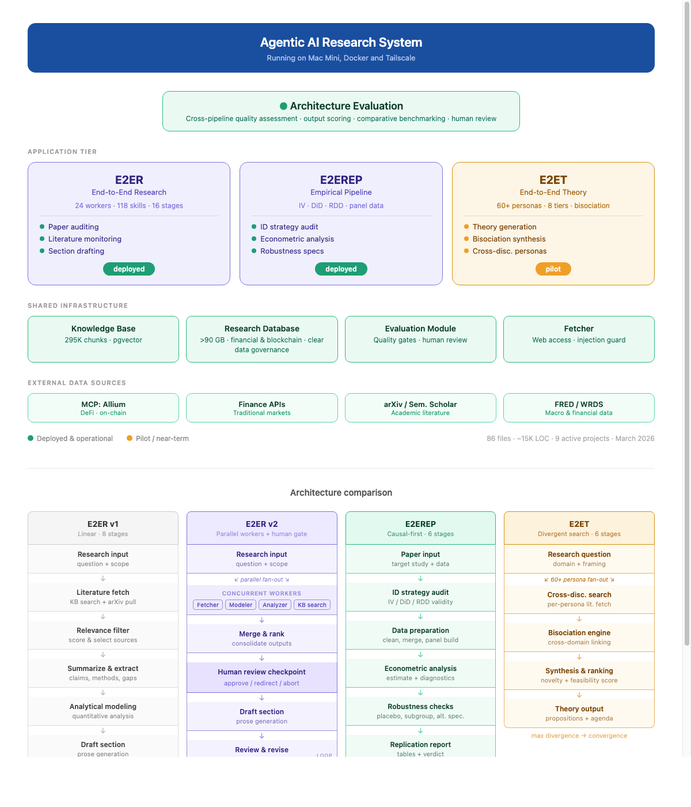
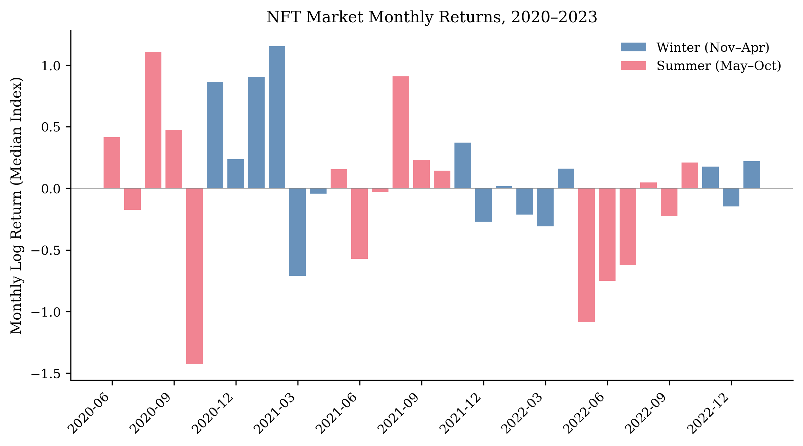

# E2ER: End-to-End Automated Researcher

[]()
[]()
[]()
[-lightgrey)]()

This repository provides an overview of the E2ER project: a set of competing AI-driven research architectures that automate empirical economics research from idea to paper draft, including data acquisition, econometric specification, estimation, robustness checks, and replication materials.

The project is part of ongoing PhD research at Goethe University Frankfurt (Chair of Information Systems, Prof. Dr. Oliver Hinz).

## Architecture at a glance

<p align="center">
  <a href="docs/architecture.html">
    
  </a>
</p>
<p align="center"><em>System architecture and pipeline comparison. <a href="docs/architecture.html">Interactive version (HTML)</a></em></p>

## Pipeline statistics (as of April 2026)

| Metric | Count |
|--------|-------|
| Total pipeline runs (E2ER v1) | 157 |
| Completed paper drafts | 133 |
| Peer review simulations | 133 |
| Technical methodology reviews | 133 |
| Consistency checks | 133 |
| Completed revisions | 133 |
| Second-iteration drafts | 30 |
| Total stage executions | 2,253 |

## Project overview

Rigorous empirical research is slow, expensive, and difficult to scale. A single causal study on blockchain economics requires identifying a natural experiment, acquiring on-chain data, specifying an econometric model, running estimation with robustness checks, and producing a paper with replication materials. Each step requires domain expertise that is scarce and unevenly distributed.

E2ER automates this pipeline. Given a research question or a discovered natural experiment, the system produces a methodologically rigorous empirical study as output. The system has been tested on Ethereum-specific data (NFT transaction histories, token distribution events, DeFi protocol data) and general empirical economics questions.

Three competing architectural designs are implemented and systematically compared:

### E2ER v1: Linear Pipeline

A sequential pipeline of 14 specialized agents processing a research question through 16 stages. Each agent handles one task (literature search, data acquisition, theory development, estimation, drafting, review) and passes artifacts to the next. Quality gates between stages enforce minimum standards before downstream agents proceed.

```
idea -> research design -> [literature | data | theory] -> merge -> estimation
     -> analysis -> draft -> [consistency | review | technical | visual] -> revision
```

24 workers, 118 skill files, 40+ skills across 9 domains (econometrics, causal inference, writing, review, data, reasoning, LaTeX, preprocessing, base research methodology).

### E2ER v2: Strategist-Controlled Architecture

A central Strategist agent (acting as first author) orchestrates 12 specialist agents (co-authors) through a work order pattern. The Strategist operates in two modes: Mode 1 (lean orchestration, structured JSON decisions at pipeline checkpoints) and Mode 2 (full editorial review with access to the complete paper).

Key differences from v1:
- Strategist makes tactical decisions at checkpoints rather than following a fixed sequence
- Specialists can be re-dispatched selectively based on Strategist assessment
- Data pipeline isolation: only the Data specialist queries databases; all others work from CSV exports
- Tiered context management (Tier 0: paper identity; Tier 1: decision-specific; Tier 2: full artifacts)
- Human review gates at research design and post-draft stages

### E2ERep: Replication Pipeline

A causal-first architecture designed to replicate published empirical findings. Takes a target study and available data as input; audits the identification strategy (IV, DiD, RDD validity), prepares data, runs econometric analysis with diagnostics, executes robustness checks (placebo tests, subgroup analysis, alternative specifications), and produces a structured replication report.

### E2ET: Theory Generation

A divergent-search architecture with 60+ intellectual personas across 8 tiers. Given a research domain, personas from different disciplines conduct independent literature searches, a bisociation engine identifies cross-domain connections, and a synthesis stage ranks output by novelty and feasibility.

## System architecture

The architectures run on a shared infrastructure platform (100xOS) consisting of:

- **Knowledge base**: 295K chunks with pgvector semantic search, hybrid keyword + embedding retrieval
- **Research database**: 94 GB across 14 datasets (financial and blockchain data, including NFT transactions, DeFi protocol data, macro indicators). Data governance is a first-class concern: all datasets are cataloged with provenance, license terms, and permitted use. On-chain data (Ethereum transactions, Hyperliquid funding rates) is public by definition. API-sourced data (Alpaca, FRED, yfinance) is stored under the respective providers' terms for personal, educational, and research use only, with no redistribution. The Allium Academic Research Grant provides licensed access to indexed on-chain data for research purposes
- **Literature pipeline**: 10-stage PDF ingestion (metadata enrichment, OCR, section-aware chunking, embedding, knowledge base integration)
- **Data ingestion**: automated pipelines for FRED, yfinance, ECB (daily), Hyperliquid/Alpaca crypto candles (hourly)
- **Security**: prompt injection detection, input sanitization, sandboxed web fetcher with SSRF protection

The full architecture diagram is available in [`docs/architecture.html`](docs/architecture.html) (open in browser).

## Example outputs

> **Disclaimer**: The papers below were produced entirely by the AI pipeline without human intervention. No human selected the research question, wrote any text, ran any estimation, or reviewed the output. The results have not been verified, peer-reviewed, or validated. They are provided solely to demonstrate what the pipeline produces autonomously. Methodological errors, incorrect interpretations, and factual inaccuracies are expected and should be assumed present. Do not cite these as research findings.

### Example 1: NFT Market Seasonality (E2ER v1)

**Input**: One-sentence idea about calendar anomalies in NFT markets.

**What the pipeline produced**: A 30+ page paper testing whether the Halloween effect (systematically higher winter returns) extends to NFT markets. The pipeline autonomously identified the research gap, formulated five testable propositions, acquired 35.8 million Ethereum-based NFT trades across eight platforms, specified econometric models, ran estimation with robustness checks (bootstrap inference, permutation tests, jackknife analysis), generated all figures, and produced a complete LaTeX manuscript with bibliography.

**Key result** (null finding): No statistically significant Halloween effect. Two-thirds of the raw seasonal differential in USD returns reflects ETH price seasonality rather than NFT-specific patterns. Day-of-week effects are significant, suggesting shorter-horizon calendar patterns dominate seasonal ones.

[Full paper PDF](examples/e2er_v1_nft_seasonality/paper.pdf) | [LaTeX source](examples/e2er_v1_nft_seasonality/main.tex) | [Figures](examples/e2er_v1_nft_seasonality/figures/) | [Replication package](examples/e2er_v1_nft_seasonality/replication/) (SQL queries, estimation code, data fetching scripts)

<p align="center">
  
</p>
<p align="center"><em>Figure 1: Monthly return distribution (AI-generated, not reviewed)</em></p>

### Example 2: Institutionalization of Bitcoin (E2ER v1)

**Input**: One-sentence idea about Bitcoin volatility convergence toward traditional assets.

**What the pipeline produced**: A paper examining whether Bitcoin's volatility has converged toward traditional asset levels following the January 2024 spot ETF approval. The pipeline autonomously designed the study, acquired daily data on Bitcoin and seven traditional benchmarks (2020-2026), estimated GARCH models and Markov-switching regime models, ran a difference-in-differences design around the ETF date, executed robustness checks (Mann-Kendall trend tests, Rambachan-Roth sensitivity, leave-one-out analysis), generated all figures, and produced a complete LaTeX manuscript.

**Key result** (null finding): Bitcoin's unconditional GARCH volatility fell from 89% to 50% after the ETF approval, and Markov-switching models identify a low-volatility regime at 32% (within commodity range). However, Bitcoin sustains this calm regime for only six days on average, compared to 82 days for equities. No discrete structural break at the ETF date; convergence is gradual. Bitcoin can reach traditional-asset volatility levels, but institutional infrastructure has not yet provided the stabilization needed to keep it there.

[Full paper PDF](examples/e2er_v1_bitcoin_institutionalization/paper.pdf) | [LaTeX source](examples/e2er_v1_bitcoin_institutionalization/main.tex) | [Figures](examples/e2er_v1_bitcoin_institutionalization/figures/) | [Tables](examples/e2er_v1_bitcoin_institutionalization/tables/) | [Replication package](examples/e2er_v1_bitcoin_institutionalization/replication/) (SQL queries, estimation code, data fetching scripts)

<p align="center">
  
</p>
<p align="center"><em>Figure 2: Event study around ETF approval date (AI-generated, not reviewed)</em></p>

### Example 3: NFT Market Seasonality (E2ER v2, structured idea stage)

**Input**: Same one-sentence idea as Example 1, processed through the v2 strategist-controlled architecture.

**What the pipeline produced**: A structured research brief with five formal propositions (weekend discount, payday liquidity surge, tax-loss harvesting analog, gas price amplifier, airdrop calendar clustering), each with direction, mechanism, testable implication, and expected finding. This example shows the v2 architecture's inception stage output.

See [`examples/e2er_v2_nft_seasonality/`](examples/e2er_v2_nft_seasonality/) for the structured idea, data description, model specification, narrative threads, and limitations analysis.

## Why not open-source yet?

The pipelines are fully functional but currently tightly coupled to the internal orchestration platform (100xOS): they depend on specific database schemas, a locally running knowledge base, Docker networking between services, and configuration that assumes a particular deployment environment. Extracting them into standalone, installable packages requires abstracting these dependencies so that anyone can run the pipelines with their own database, their own LLM provider, and their own data sources. This is planned work, not a licensing decision: the intent is to open-source everything under a permissive license once the installation path is usable without replicating the full internal infrastructure.

## Ongoing work

The current focus areas are:

- **Open-sourcing the pipelines**: decoupling E2ER, E2ER v2, and E2ERep from the internal orchestration platform so they can be installed and run independently. This involves abstracting database dependencies, making LLM backends configurable, and providing a standalone setup path that does not require the full 100xOS infrastructure
- **Discovery-to-execution loop**: closing the gap from automated experiment discovery to automated study production, so that the system can identify a natural experiment, determine data requirements, configure the pipeline, and produce a study without manual specification
- **Multi-LLM support**: implementing pipelines with different LLMs beyond the current Claude CLI backend, enabling cross-model comparison and reducing single-provider dependency
- **Quality analytics**: enhancing KPIs and analytics to systematically measure and improve output quality relative to token consumption across pipeline runs
- **MCP data integration**: connecting to Allium via MCP with human-in-the-loop querying, including auto-discovery of available datasets for econometric estimation
- **Open results platform**: publishing all findings (including null results) with replication materials, searchable by economic model type, protocol, and mechanism
- **Architectural comparison**: systematic comparison of the three pipeline designs on identical research questions

## Contributing

This project is moving toward open-source, and there are several ways to get involved before the full release:

- **Research questions**: if you have a question about an economic model on Ethereum that you think could be tested with on-chain data, open an issue. The discovery system can evaluate whether a suitable natural experiment exists.
- **Data access**: if you have access to datasets that could improve the pipeline's coverage (e.g., governance vote histories, protocol-specific event data, labeled wallet data), I am interested in collaborations.
- **Architectural ideas**: if you work on automated research systems, LLM-driven pipelines, or causal inference tooling, I welcome discussion on design choices and benchmarking approaches.
- **Replication**: try running the replication packages in the examples. If something breaks or produces unexpected results, that is useful feedback.

## Contact

Björn Hanneke | [www.bjornhanneke.com](https://www.bjornhanneke.com) | hanneke@wiwi.uni-frankfurt.de

PhD Candidate, Goethe University Frankfurt
Chair of Information Systems and Information Management (Prof. Dr. Oliver Hinz)

ORCID: [0009-0000-7466-9581](https://orcid.org/0009-0000-7466-9581) | [Google Scholar](https://scholar.google.com/citations?user=N5fbuZIAAAAJ) | [LinkedIn](https://linkedin.com/in/bhanneke)
