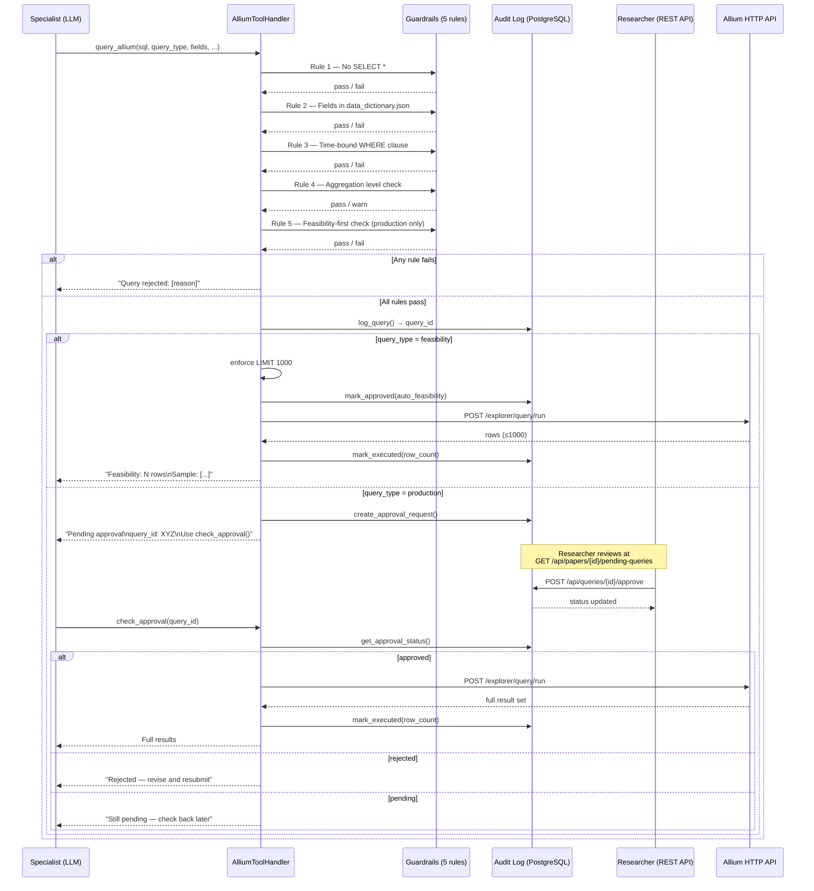

# Data Module — Allium Query Flow

Every SQL query from a specialist passes through 5 guardrails before reaching the Allium
HTTP API. Production queries additionally require human researcher approval.

