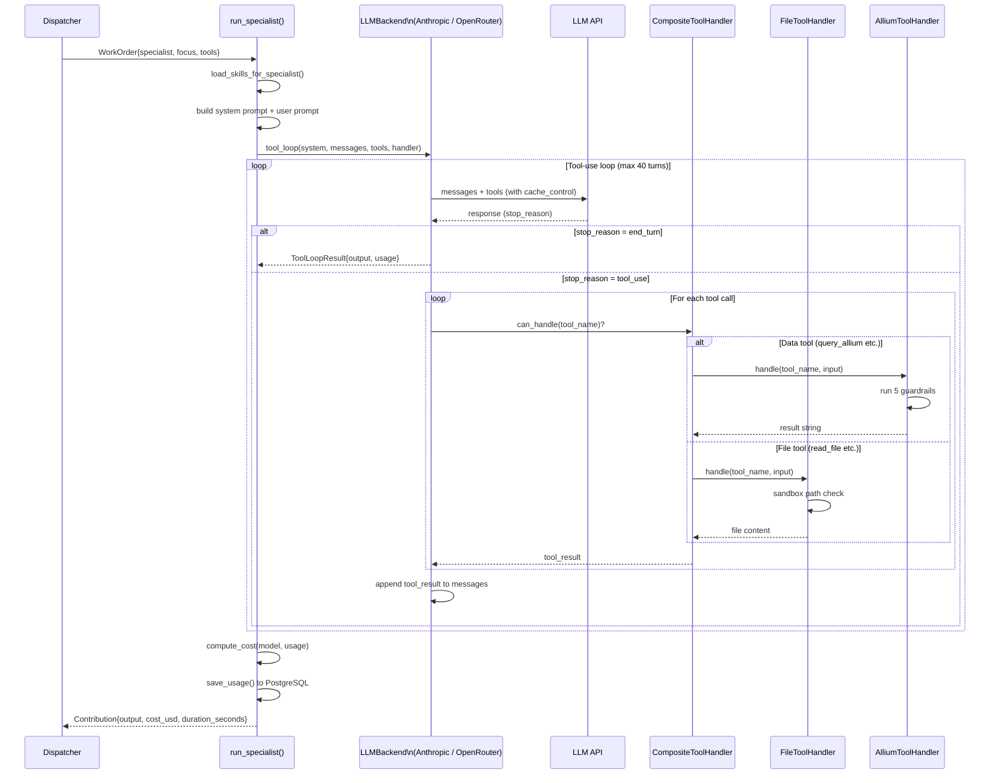

# LLM Tool-Use Loop

E2ER v3 owns the tool-use loop directly — no Claude Code CLI subprocess. This enables
intercepting every tool call for guardrails, cost tracking, and custom routing.

```mermaid
sequenceDiagram
    participant Dispatcher as Dispatcher
    participant Runner as run_specialist()
    participant Backend as LLMBackend\n(Anthropic / OpenRouter)
    participant LLM as LLM API
    participant Handler as CompositeToolHandler
    participant File as FileToolHandler
    participant Data as AlliumToolHandler

    Dispatcher->>Runner: WorkOrder{specialist, focus, tools}
    Runner->>Runner: load_skills_for_specialist()
    Runner->>Runner: build system prompt + user prompt
    Runner->>Backend: tool_loop(system, messages, tools, handler)

    loop Tool-use loop (max 40 turns)
        Backend->>LLM: messages + tools (with cache_control)
        LLM-->>Backend: response (stop_reason)

        alt stop_reason = end_turn
            Backend-->>Runner: ToolLoopResult{output, usage}
        else stop_reason = tool_use
            loop For each tool call
                Backend->>Handler: can_handle(tool_name)?
                alt Data tool (query_allium etc.)
                    Handler->>Data: handle(tool_name, input)
                    Data->>Data: run 5 guardrails
                    Data-->>Handler: result string
                else File tool (read_file etc.)
                    Handler->>File: handle(tool_name, input)
                    File->>File: sandbox path check
                    File-->>Handler: file content
                end
                Handler-->>Backend: tool_result
            end
            Backend->>Backend: append tool_result to messages
        end
    end

    Runner->>Runner: compute_cost(model, usage)
    Runner->>Runner: save_usage() to PostgreSQL
    Runner-->>Dispatcher: Contribution{output, cost_usd, duration_seconds}
```
