# Pipeline Overview

The full E2ER v3 paper pipeline from research question to completed manuscript. The Strategist
meta-agent controls all transitions; each box represents one or more specialist invocations.

```mermaid
flowchart TD
    A([Research Question]) --> B[Idea Developer]
    B --> C[Literature Scanner]
    C --> D[Identification Strategist]
    D --> E{Data needed?}

    E -- Yes --> F[Data Architect\ndefines data_dictionary.json]
    E -- No --> G[Econometrics Specialist]
    F --> FA[Allium Feasibility Queries\nauto-approved / LIMIT 1000]
    FA --> FB{Production\nqueries?}
    FB -- Yes --> FC[Human Approval\nvia REST API]
    FC --> FD[Data Analyst\nexecutes + summarizes]
    FB -- No --> G
    FD --> G

    G --> H[Section Writer / Paper Drafter]
    H --> I{Mode?}

    I -- single_pass --> R
    I -- iterative --> J[Ceiling Check\nStrategist assesses improvement]

    J --> K{Verdict}
    K -- continue --> H
    K -- pivot --> L[Targeted Pivot Specialists\nmax 1 pivot]
    L --> M[Self-Attack\nadversarial flaw finding]
    K -- proceed --> M

    M --> N{Critical\nfindings?}
    N -- Yes --> O[Targeted Revision\ntop 3 critical findings]
    N -- No --> P
    O --> P[Polish Stack\nparallel: formula / numerics /\ninstitutions / bibliography / equilibria]

    P --> R[Formal Review\n6 reviewers in parallel]
    R --> S[Mechanical Aggregation\n3-rule system]

    S --> T{Verdict}
    T -- ACCEPT / MINOR --> U[Replication Packager]
    T -- MAJOR_REVISION --> V[Revisor] --> U
    T -- HARD_REJECT / MECHANISM_FAIL --> W([Failed])

    U --> X[GitHub Push\nLaTeX + replication package]
    X --> Y([Completed])

    style A fill:#e8f4fd
    style Y fill:#d4edda
    style W fill:#f8d7da
    style FC fill:#fff3cd
```

