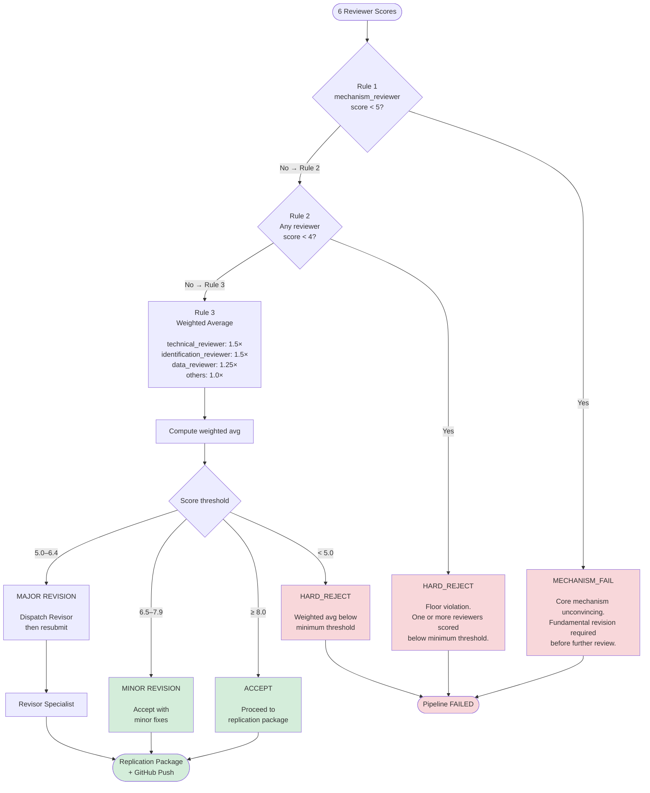

# Mechanical Review Aggregation

Three-rule deterministic system for aggregating reviewer scores. Rules are checked
in order; the first triggered determines the outcome.

```mermaid
flowchart TD
    START([6 Reviewer Scores]) --> R1

    R1{Rule 1\nmechanism_reviewer\nscore < 5?}
    R1 -- Yes --> MFAIL[MECHANISM_FAIL\n\nCore mechanism unconvincing.\nFundamental revision required\nbefore further review.]
    R1 -- No → Rule 2 --> R2

    R2{Rule 2\nAny reviewer\nscore < 4?}
    R2 -- Yes --> HREJ[HARD_REJECT\n\nFloor violation.\nOne or more reviewers scored\nbelow minimum threshold.]
    R2 -- No → Rule 3 --> R3

    R3[Rule 3\nWeighted Average\n\ntechnical_reviewer: 1.5×\nidentification_reviewer: 1.5×\ndata_reviewer: 1.25×\nothers: 1.0×]
    R3 --> SCORE[Compute weighted avg]

    SCORE --> V{Score threshold}
    V -- ≥ 8.0 --> ACC[ACCEPT\n\nProceed to\nreplication package]
    V -- 6.5–7.9 --> MINOR[MINOR REVISION\n\nAccept with\nminor fixes]
    V -- 5.0–6.4 --> MAJOR[MAJOR REVISION\n\nDispatch Revisor\nthen resubmit]
    V -- < 5.0 --> HREJ2[HARD_REJECT\n\nWeighted avg below\nminimum threshold]

    ACC --> FINAL([Replication Package\n+ GitHub Push])
    MINOR --> FINAL
    MAJOR --> REV[Revisor Specialist] --> FINAL
    MFAIL --> FAIL([Pipeline FAILED])
    HREJ --> FAIL
    HREJ2 --> FAIL

    style MFAIL fill:#f8d7da
    style HREJ fill:#f8d7da
    style HREJ2 fill:#f8d7da
    style FAIL fill:#f8d7da
    style ACC fill:#d4edda
    style MINOR fill:#d4edda
    style FINAL fill:#d4edda
```
