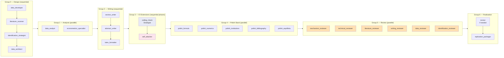

# Specialist Execution DAG

Specialists are grouped into parallel execution groups. Within each group, all specialists
run concurrently. Groups are executed in order (group 0 → 1 → 2 → ...).

```mermaid
graph LR
    subgraph G0["Group 0 — Design (sequential)"]
        ID[idea_developer]
        LS[literature_scanner]
        IS[identification_strategist]
        DA[data_architect]
        ID --> LS --> IS --> DA
    end

    subgraph G1["Group 1 — Analysis (parallel)"]
        direction TB
        DAN[data_analyst]
        ES[econometrics_specialist]
    end

    subgraph G2["Group 2 — Writing (sequential)"]
        SW[section_writer]
        AW[abstract_writer]
        LF[latex_formatter]
        SW --> AW --> LF
    end

    subgraph G3["Group 3 — V3 Extensions (sequential phases)"]
        CC[ceiling_check\nStrategist]
        SA[self_attacker]
        CC --> SA
    end

    subgraph G4["Group 4 — Polish Stack (parallel)"]
        direction TB
        PF[polish_formula]
        PN[polish_numerics]
        PI[polish_institutions]
        PB[polish_bibliography]
        PE[polish_equilibria]
    end

    subgraph G5["Group 5 — Review (parallel)"]
        direction TB
        MR[mechanism_reviewer]
        TR[technical_reviewer]
        LR[literature_reviewer]
        WR[writing_reviewer]
        DR[data_reviewer]
        IR[identification_reviewer]
    end

    subgraph G6["Group 6 — Finalisation"]
        RV[revisor\nif needed]
        RP[replication_packager]
        RV --> RP
    end

    G0 --> G1 --> G2 --> G3 --> G4 --> G5 --> G6

    style MR fill:#ffe0b2
    style TR fill:#ffe0b2
    style LR fill:#ffe0b2
    style WR fill:#ffe0b2
    style DR fill:#ffe0b2
    style IR fill:#ffe0b2
    style SA fill:#fce4ec
    style CC fill:#e8eaf6
```
