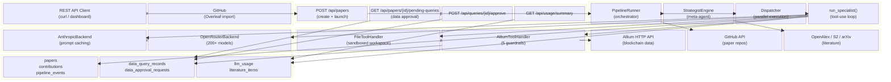

# System Architecture

High-level component view of E2ER v3. The pipeline runs as a FastAPI service; all LLM
calls go through the owned tool-use loop; data access is sandboxed behind guardrails.

```mermaid
block-beta
    columns 3

    block:USER["User / Researcher"]:1
        A["REST API Client\n(curl / dashboard)"]
        B["GitHub\n(Overleaf import)"]
    end

    block:API["FastAPI (port 8280)"]:1
        C["POST /api/papers\n(create + launch)"]
        D["GET /api/papers/{id}/pending-queries\n(data approval)"]
        E["POST /api/queries/{id}/approve"]
        F["GET /api/usage/summary"]
    end

    block:PIPELINE["Pipeline Core"]:1
        G["PipelineRunner\n(orchestrator)"]
        H["StrategistEngine\n(meta-agent)"]
        I["Dispatcher\n(parallel execution)"]
        J["run_specialist()\n(tool-use loop)"]
    end

    block:LLM["LLM Backends (BYOK)"]:1
        K["AnthropicBackend\n(prompt caching)"]
        L["OpenRouterBackend\n(200+ models)"]
    end

    block:TOOLS["Tool Handlers"]:1
        M["FileToolHandler\n(sandboxed workspace)"]
        N["AlliumToolHandler\n(5 guardrails)"]
    end

    block:EXTERNAL["External Services"]:1
        O["Allium HTTP API\n(blockchain data)"]
        P["GitHub API\n(paper repos)"]
        Q["OpenAlex / S2 / arXiv\n(literature)"]
    end

    block:DB["PostgreSQL + pgvector"]:1
        R["papers\ncontributions\npipeline_events"]
        S["data_query_records\ndata_approval_requests"]
        T["llm_usage\nliterature_items"]
    end

    A --> C
    C --> G
    D --> S
    E --> S
    F --> T
    G --> H
    G --> I
    I --> J
    J --> K
    J --> L
    J --> M
    J --> N
    N --> O
    N --> S
    G --> P
    H --> Q
    J --> R
    J --> T
```
