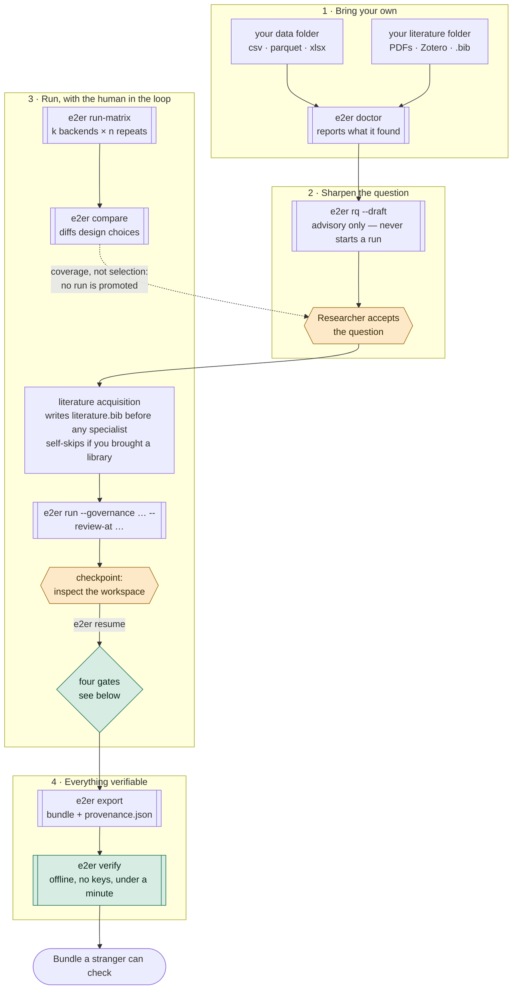
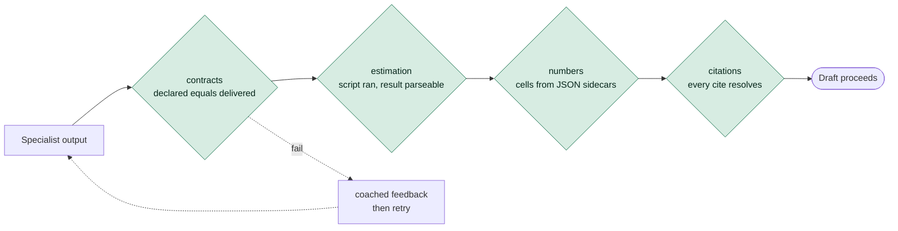

# The researcher's workflow

Where a human decides, where the machine runs, and where the gates sit. This is
the outside view; [`pipeline_overview.md`](pipeline_overview.md) is the same run
seen from inside, as specialist invocations. The prose version, with what each
gate actually checks, is [`docs/WORKFLOW.md`](../WORKFLOW.md).

Diamonds are human decisions. Nothing advances past one without the researcher.

## The gate chain, and what the regime changes

Four gates stand between the analysis and the paper. The regime chosen at
`e2er run --governance` decides which of them **block** — but every gate runs
in every regime. A gate that is not enforcing still computes its verdict and
logs a `gate_shadow` event saying what it would have caught.

That is what makes an ungoverned run *measured* rather than merely unblocked,
and what makes governance assignable as a treatment instead of only
describable.

| Regime | contracts | estimation | numbers | citations |
|---|---|---|---|---|
| `full` | blocks | blocks | blocks | blocks |
| `contracts` | blocks | shadow | shadow | shadow |
| `off` | shadow | shadow | shadow | shadow |

An unrecognised regime resolves to `full`, so a typo fails closed.

**One exception cuts across the table.** *Reliability* checks block in every
regime, `off` included. Whether the estimation script ran and wrote a
parseable, non-empty result is a question about the pipeline, not about the
paper, and the answer has to be the same in every arm — otherwise the `off`
cell measures a broken pipeline rather than an ungoverned one, and fabrication
is confounded with completion. That is not hypothetical; it is why the
distinction exists. See `enforces_check` in `src/core/governance.py`.

## What the picture does not show

No arrow above establishes that the analysis was *defensible*. The chain runs
from data through analysis into the manuscript and back out again, and
verification is a question about that chain — deterministic, cheap, settled by
a machine. Robustness is a different question with no deterministic answer, and
nothing in this diagram touches it.
